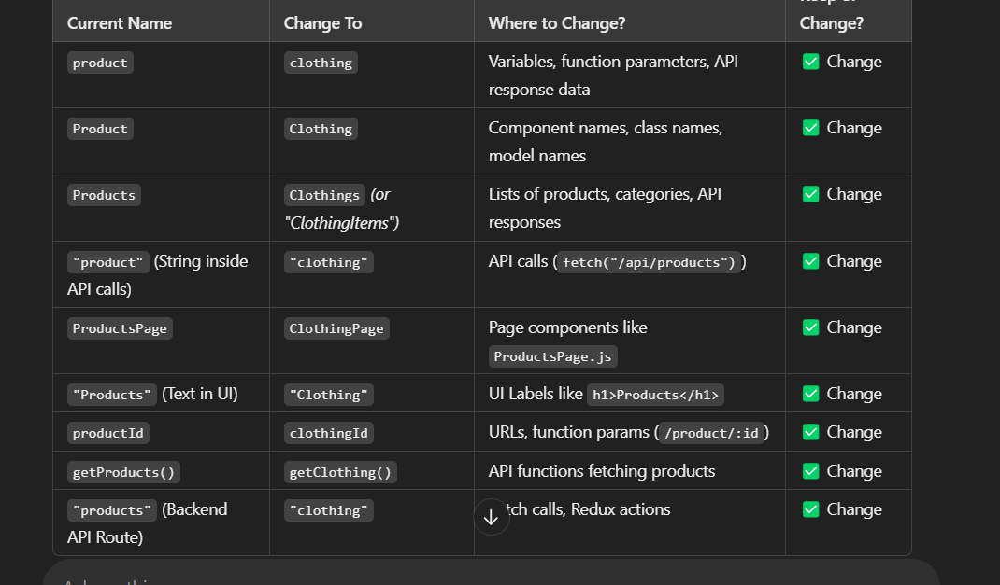

backend- npm i nodemon bcrypt cloudinary cookie-parser cors crypto dotenv express http joi jsonwebtoken mongoose multer 
nodemailer razorpay strip validator eslint prettier 

frontend- tailwindcss installation...
          npm i axios react-router-dom react-toastify dotenv 

          